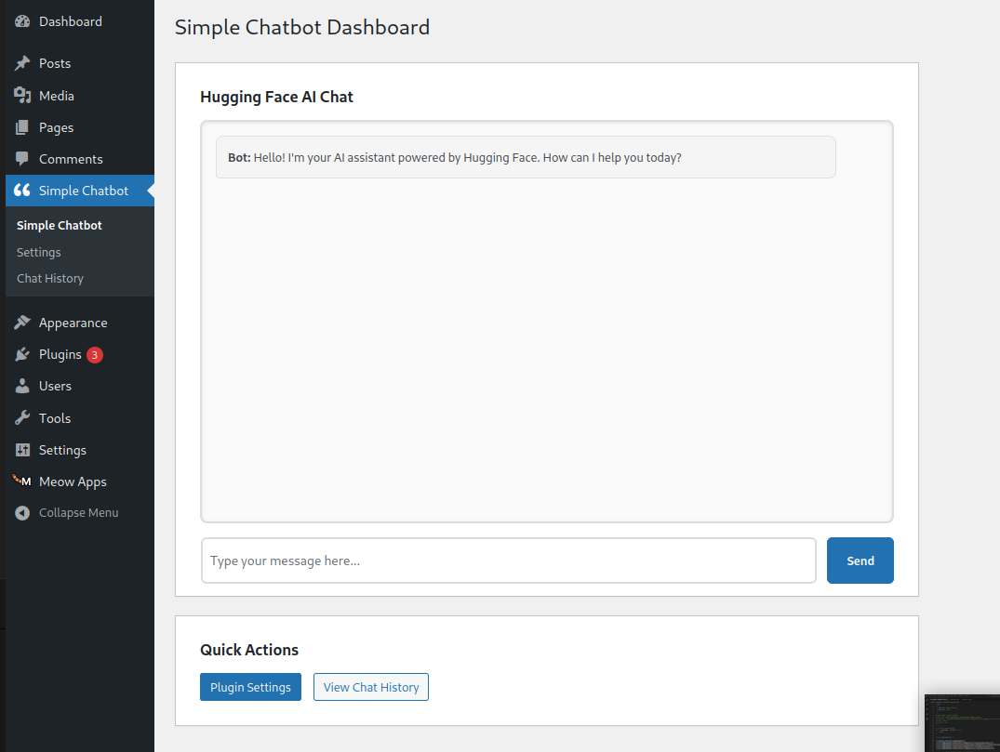

# Wordpress plugin
## Simple chatbot

A simple chatbot that lets you have a conversation with an ai. it requires the user to input an api key from deepseek api platform.Put in the hugging face api key 
and allow the wordpress users access to top of the line ai.

## Admin chat

The admin will have a chatbot which he will configure with his own hf key and will let his users access to the chatbot. The context can be configured in the settings. The
hf key will also be provided in the settings.

## User Chat
The user chat can be accessed simple by using the keyword **simple_chatbot** inside the frontend page of wordpress. The chatbot will appear at the edge of the screen and by clicking it one can talk to the chatbot.

The chatbot will look like this.

## Future development
1. Allow the user to change between different models.
2. Change the style of the bot logo and look.

## Flow of ajax

[X] Frontend → AJAX request to admin-ajax.php through the javascript

[X] admin-ajax.php → "What's the action?" → send_chat_message

[X] admin-ajax.php → "Who handles send_chat_message?" → Your function

[X] Your function → Processes message, generates response

[X] Your function → wp_send_json_success()

[X] Frontend → Receives JSON response in success: callback

